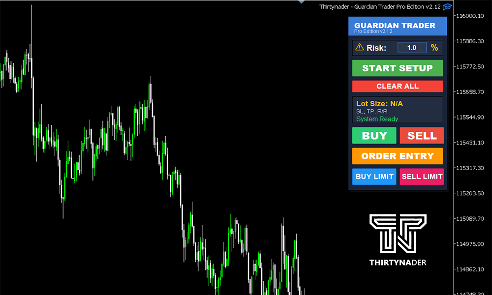
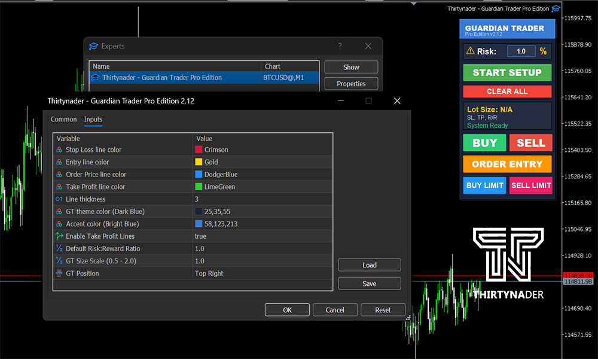

Guardian Trader Pro Edition
  
  

## 📋 Overview

Guardian Trader Pro is a powerful trading assistant that helps you manage risk precisely by calculating optimal lot sizes based on your stop loss and risk percentage. With a modern, intuitive interface, it simplifies position sizing and trade execution.

## ✨ Key Features

 • Smart Lot Size Calculator - Automatically calculates position size based on your risk percentage and stop loss distance
 
 • Dual Trading Modes:
 
      • Market Execution - Instant Buy/Sell orders
      • Pending Orders - Buy/Sell Limit orders
      
 • Visual Setup - Drag-and-drop price lines for Entry, Stop Loss, and Take Profit
 
 • Risk/Reward Display - Real-time calculation of SL, TP distances and R:R ratio
 
 • Customizable UI - Scalable interface (0.5x - 2x) with adjustable positioning
 
 • Multi-Asset Support - Optimized for Forex, Gold, Silver, Oil, Indices (US30, NAS100, SPX)
 
 • Take Profit Management - Optional TP line with customizable risk/reward ratio
 
 • Real-time Updates - Lot size recalculates instantly when you move lines
 
 • Sound Alerts - Audio feedback for actions and confirmations
 
 
## 📥 Installation

 Step 1: Download the File
 
After purchase, you will receive the Guardian Trader Pro.ex5 file via email.

 Step 2: Install in MetaTrader 5
 
 
 • Option A: Automatic Installation
 
Double-click the Guardian Trader Pro.ex5 file

MetaTrader 5 will open automatically

Confirm the installation prompt

• Option B: Manual Installation

Open MetaTrader 5

Click File → Open Data Folder

Navigate to: MQL5 → Experts

Copy Guardian Trader Pro.ex5 into the Experts folder

Restart MetaTrader 5 or press F5 in Navigator

Step 3: Attach to Chart

Open Navigator panel (Ctrl+N)

Expand Expert Advisors section

Find Guardian Trader Pro

Drag and drop onto any chart

In the settings window:

    • Go to Common tab
    
    • Enable Allow Algo Trading
    
    • Click OK
    

Step 4: Verify Installation

The Guardian Trader panel appears on your chart

Check the Experts tab in Terminal for confirmation message

You should see: "Guardian Trader Pro - Modern Edition Ready!"

## 🎯 How to Use

Method 1: Market Orders (Instant Execution)

1- Start Setup

    • Click the START SETUP button
    
    • Three lines appear: Entry (Gold), Stop Loss (Red), Take Profit (Green)
    
2- Adjust Your Levels

    • Drag the Entry Line to your desired entry price
    
    • Drag the Stop Loss line to set your risk level
    
    • Drag the Take Profit line to set your target (optional)
    
3- Set Risk Percentage

    • Click on the risk input field (default 1%)
    
    • Enter your desired risk (0.1% to 50%)
    
    • Press Enter to confirm
    
4- Review Information

    • Check the calculated lot size
    
    • Review SL distance in pips
    
    • Verify Risk/Reward ratio
    
5- Execute Trade

    • Click BUY for long positions
    
    • Click SELL for short positions
    
    • Trade executes instantly at market price
    

Method 2: Pending Orders (Limit Orders)

1- Start Order Entry

    • Click the ORDER ENTRY button
    
    • Three lines appear: Order Price (Blue), Stop Loss (Red), Take Profit (Green)
    
3- Position Your Orders

    • Drag Order Price line to your desired entry level
    
    • Drag Stop Loss below Order Price for Buy Limit (above for Sell Limit)
    
    • Drag Take Profit to your target level
    
4- Set Risk & Review

    • Adjust risk percentage if needed
    
    • Check lot size calculation
    
    • Verify all price levels
    
3- Place Order

    • Click BUY LIMIT (order price must be below current price)
    
    • Click SELL LIMIT (order price must be above current price)
    
    • Order is placed and will execute when price reaches your level
    

## Additional Functions

  • CLEAR ALL - Removes all lines and resets the setup
  
  • Risk Input - Accepts decimal values (e.g., 0.5, 1.5, 2.0)
  
  • Line Dragging - Lot size updates automatically as you move lines
  
## ⚙️ Configuration

// Risk Management

input double DefaultRiskReward = 1.0;     // Default R:R ratio

input bool EnableTakeProfit = true;       // Show TP line

// Visual Settings

input double UIScale = 1.0;               // UI size (0.5 - 2.0)

input UI_POSITION UIPosition = UI_TOP_RIGHT;

// Line Colors & Style

input color StopLossColor = clrCrimson;

input color EntryLineColor = clrGold;

input color OrderPriceColor = clrDodgerBlue;

input color TakeProfitColor = clrLimeGreen;

input int LineWidth = 3;

// Theme

input color UIThemeColor = C'25,35,55';   // Dark Blue

input color UIAccentColor = C'58,123,213'; // Bright Blue

## 🎨 Interface Customization

UI Positions:

    • Top Left
    
    • Top Right (default)
    
    • Bottom Left
    
    • Bottom Right
    
    • Custom
    
Scaling: Adjust UIScale from 0.5 (compact) to 2.0 (large) for different screen sizes

## 💡 Tips

  • Optimal Distances: The EA automatically suggests optimal pip distances based on the asset type
  
  • Risk Management: Start with 1% risk and adjust based on your strategy
  
  • Multi-Timeframe: Works on all timeframes (M1 to MN)
  
  • Precision: Lot size follows broker's minimum/maximum lot and step size
  
  • One Chart: Only attach to one chart at a time for best performance
  

## ⚠️ Requirements

  • MetaTrader 5 platform (build 2000+)
  
  • Active trading account (demo or live)
  
  • Algo Trading must be enabled
  
  • Internet connection
  

## 💰 Purchase

  • Price: $50 USD
  
  • This is commercial software. To purchase:
  
📧 Email: Thirtynader@gmail.com

  • You will receive:
  
    1- Payment instructions
    
    2- Compiled EX5 file (ready to use)
    
    3- Installation guide
    
    4- Full support
    

## 🔒 Note

This repository contains only the source code for reference. The compiled EA (EX5 file) is required to run on MetaTrader 5 and must be purchased.

Developed by Thirtynader
