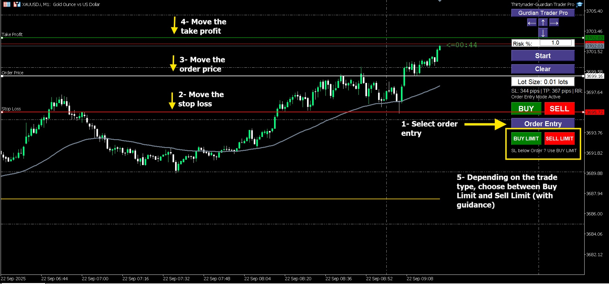
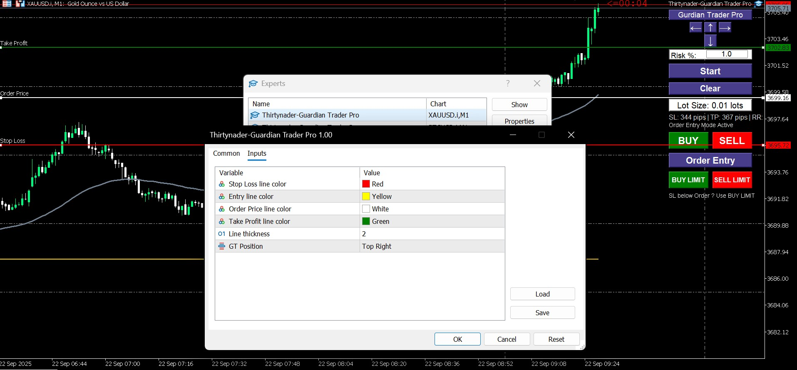
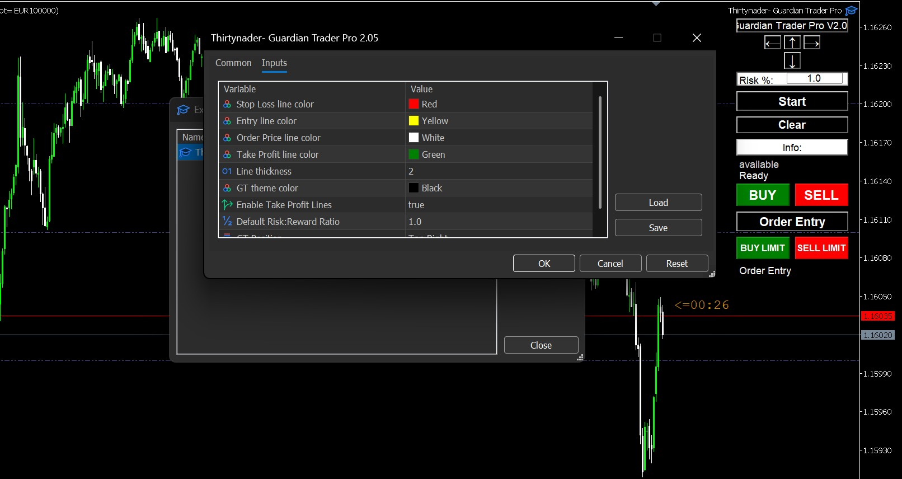

# Guardian Trader Pro – MT5 Expert Advisor

**Guardian Trader Pro** is the advanced version of the Guardian Trader Expert Advisor for MetaTrader 5.  
It extends the Lite version with full trade management features, interactive order entry, and drag & drop levels.

---

## Features

- Position Size Calculator - automatically calculates lot size based on selected risk %  
- Interactive Trading Panel - one-click BUY / SELL execution  
- Order Entry Mode - place pending orders (Buy Limit / Sell Limit) with built-in guidance  
- Drag & Drop Levels - adjust Stop Loss, Take Profit, and Entry Price directly on the chart  
- Fast Execution - simplified and quick trade operations  
- Risk Management - adjustable risk percentage for safe trading

## Major Updates:

✨ Take Profit Integration: Both Start and Order Entry modes now include automatic Take Profit lines.

🎚️ TP Control: New input parameter to enable/disable Take Profit functionality.

📏 Smart Distance Calculation: Optimized line spacing based on symbol type.

🎯 Risk:Reward Display: Real-time R:R ratio calculation and display.

## Technical Improvements:

• Reduced default pip distance from 50 to 20 pips for better visibility
• Symbol-specific distance calculations for different asset classes
• Enhanced info display with Risk:Reward metrics
• Better handling of Take Profit in all order types

---

## Screenshots

  
  

Updates:

---

## Versions

- [Guardian Trader Lite (Free)](https://github.com/Thirtynader/Guardian-Trade-Lite-MT5)  
- Guardian Trader Pro (this repository)  

---

## How to Use
Quick Start Guide
Method 1: Market Execution (Start Mode)

Click "Start" Button

🟡 Yellow Entry line appears at current price
🔴 Red Stop Loss line appears 20 pips away
🟢 Green Take Profit line appears (if enabled)

Adjust Lines (optional)

Drag lines to your desired levels
Watch lot size update automatically
Monitor R:R ratio in real-time

Execute Trade

Click BUY for long positions
Click SELL for short positions
Trade executes at market price with your SL and TP

Method 2: Pending Orders (Order Entry Mode)

Click "Order Entry" Button

⚪ White Order Price line at current price
🔴 Red Stop Loss line 20 pips away
🟢 Green Take Profit line (if enabled, 2:1 R:R default)

Position Your Lines

Move Order Price to entry level
Adjust Stop Loss distance
Adjust Take Profit target
Check R:R ratio and lot size

Place Pending Order

BUY LIMIT: Order price below current price
SELL LIMIT: Order price above current price
EA validates order direction automatically

Risk Management

Set Risk %: Edit the risk field (default 1.0%)
Valid Range: 0.1% to 50%
Dynamic Calculation: Changes apply instantly
Balance Protection: Maximum position size enforced

UI Management

Manual Movement: Use ↑ ↓ ← → arrow buttons
20-pixel Steps: Precise positioning control
Auto-Adaptation: UI adjusts on chart resize
Clear Button: Remove all lines and reset

⚠️ Important Notes
✅ Supported Order Types

Market Orders (Buy/Sell)
Pending Orders (Buy Limit/Sell Limit)
All with Stop Loss and optional Take Profit

⚠️ Limitations

No Stop Orders: Buy Stop and Sell Stop not implemented
No Trailing Stop: Manual management required
Single Chart: One instance per chart recommended

🛡️ Safety Features

Validates order direction vs current price
Enforces broker lot size limits
Prevents invalid Stop Loss distances
Confirms risk percentage range
Real-time balance checking

🐛 Troubleshooting
Lot size shows 0.00:

Check that both lines are placed correctly
Ensure Stop Loss distance > 0
Verify account balance > 0
Try adjusting risk percentage

Order placement fails:

Verify AutoTrading is enabled
Check broker connection
Ensure sufficient margin
Validate order price vs market price

Lines disappear:

Click "Clear" then "Start" again
Restart EA (remove and re-add to chart)
Check chart template settings

UI not visible:

Change UIPosition setting
Use arrow buttons to move panel
Check chart zoom level

Take Profit not showing:

Verify EnableTakeProfit = true in settings
Restart EA after changing parameters

## Installation & Usage

1. Download the **EX5 file** after purchase.  
2. Copy the file into:  
3. Restart MetaTrader 5.  
4. In MT5, open the **Navigator** panel (`Ctrl+N`).  
5. Find **Guardian Trader Pro** under *Expert Advisors*.  
6. Drag it onto the chart and allow algorithmic trading.  
---

## How to Get the Pro Version

To receive the **EX5 file** and support, please contact:  
**Thirtynader@gmail.com**

---

## Disclaimer

This Expert Advisor is a trading tool for risk and position management.  
Final trading decisions are the sole responsibility of the trader.
