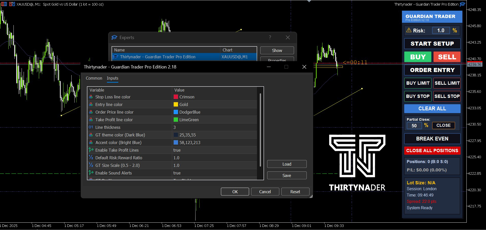
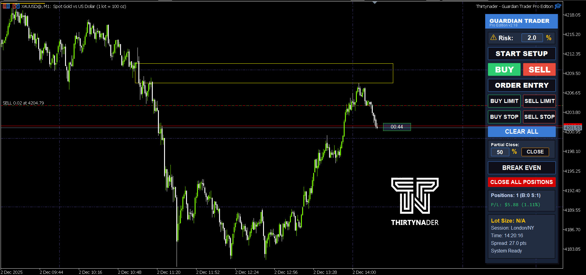

## Guardian Trader Pro Edition
Professional Money Management & Trading Tool for MetaTrader 5

  

 

## 📋 Overview

Guardian Trader Pro is an advanced trading expert for professional money management and trade execution in MetaTrader 5. This tool helps you manage your trades with precision by automatically calculating position sizes based on your risk percentage.

## ✨ Key Features

📊 Automatic Lot Calculation based on risk percentage

🎯 Fast Trade Execution (Buy/Sell Market Orders)

📝 All Pending Order Types (Buy/Sell Limit & Stop)

🎨 Modern Customizable UI with multiple themes

🔄 Partial Position Closing with custom percentage

⚡ One-Click Break Even for all positions

📈 Live Statistics Display for P/L and positions

🌍 Trading Session Display with spread monitoring

🔊 Sound Alerts (optional)

🎛️ Scalable UI (0.5x to 2x)

## 🚀 Installation

• Copy the .ex5 file to:

    MetaTrader 5/MQL5/Experts/

• Restart MetaTrader 5
• Drag the expert from Navigator to your chart
• Configure your preferred settings and click OK

## 📖 User Guide

1️⃣ Setting Your Risk

Enter your desired risk percentage in the Risk field (typically 1-2%)

Text color changes based on risk level:

• White: up to 2%

• Yellow: 2-5%

• Orange: 5-10%

• Red: above 10%

2️⃣ Market Orders

Step 1: Click the START SETUP button

Step 2: Three lines appear on the chart:

🟡 Entry (Gold): Entry price

🔴 Stop Loss (Red): Your stop loss level

🟢 Take Profit (Green): Your take profit target

Step 3: Drag the lines to your desired levels

Step 4: Position size is calculated automatically

Step 5: Click BUY or SELL to execute

3️⃣ Pending Orders

Step 1: Click the ORDER ENTRY button

Step 2: Three lines appear:

🔵 Order Price (Blue): Pending order price

🔴 Stop Loss (Red)

🟢 Take Profit (Green)

Step 3: Adjust the lines to your levels

Step 4: Select one of the following:

• BUY LIMIT: Buy below current price

• SELL LIMIT: Sell above current price

• BUY STOP: Buy above current price

• SELL STOP: Sell below current price

4️⃣ Position Management
Partial Close

Enter the desired percentage (e.g., 50)

Click the CLOSE button

The specified percentage of all positions will be closed

Break Even

Click BREAK EVEN

Stop Loss of all profitable positions moves to entry price

Close All

Click CLOSE ALL POSITIONS

All positions for the current symbol will be closed

5️⃣ Clear Lines

Click CLEAR ALL button

All lines are removed from the chart

## ⚙️ Customizable Settings

<table>
  <thead>
    <tr>
      <th style="text-align:left;">Parameter</th>
      <th style="text-align:center;">Default</th>
      <th style="text-align:left;">Description</th>
    </tr>
  </thead>
  <tbody>
    <tr>
      <td><code>DefaultRiskReward</code></td>
      <td style="text-align:center;">1.0</td>
      <td>Risk to Reward ratio</td>
    </tr>
    <tr>
      <td><code>UIScale</code></td>
      <td style="text-align:center;">1.0</td>
      <td>UI scale factor (0.5 - 2.0)</td>
    </tr>
    <tr>
      <td><code>UIPosition</code></td>
      <td style="text-align:center;">Top Right</td>
      <td>Panel position on chart</td>
    </tr>
    <tr>
      <td><code>EnableTakeProfit</code></td>
      <td style="text-align:center;">true</td>
      <td>Enable/Disable Take Profit lines</td>
    </tr>
    <tr>
      <td><code>EnableSoundAlerts</code></td>
      <td style="text-align:center;">true</td>
      <td>Enable/Disable sound alerts</td>
    </tr>
    <tr>
      <td><code>LineWidth</code></td>
      <td style="text-align:center;">3</td>
      <td>Line thickness</td>
    </tr>
  </tbody>
</table>

💡 Important Tips

✅ Always test on a demo account first

✅ Start with low risk percentage (1-2%)

✅ Verify the calculated lot size before executing

✅ High spread is shown in red color

✅ Current trading session is displayed in the panel

## 💰 Purchase & Support

Price: $50 (One-time payment)

Benefits:

✅ Free lifetime support

✅ Free updates forever

✅ Installation assistance

## Contact:

📧 Email: Thirtynader@gmail.com

## 🔄 Version History
v2.18 (Current)

Improved lot size calculations

UI optimization

Made with ❤️ by Thirtynader
⭐ If you love Guardian Trader Pro, give us a star!

## ---------پارسی-----------

## 📋 معرفی

Guardian Trader Pro یک اکسپرت معاملاتی پیشرفته برای مدیریت حرفه‌ای سرمایه و اجرای معاملات در متاتریدر 5 است. این ابزار به شما کمک می‌کند تا با محاسبه خودکار حجم معاملات بر اساس درصد ریسک، معاملات خود را با دقت بالا مدیریت کنید.

✨ امکانات کلیدی

📊 محاسبه خودکار لات بر اساس درصد ریسک

🎯 اجرای سریع معاملات (Buy/Sell Market)

📝 انواع دستورات معلق (Buy/Sell Limit & Stop)

🎨 رابط کاربری مدرن و قابل تنظیم

🔄 بستن جزئی معاملات با درصد دلخواه

⚡ انتقال به Break Even با یک کلیک

📈 نمایش آمار زنده سود/زیان و پوزیشن‌ها

🌍 نمایش سشن معاملاتی و اسپرد

🔊 هشدارهای صوتی قابل تنظیم

🎛️ مقیاس‌پذیری UI (0.5x تا 2x)

## 🚀 نصب و راه‌اندازی

فایل .ex5 را در پوشه زیر کپی کنید:

MetaTrader 5/MQL5/Experts/

MetaTrader را ری‌استارت کنید

از منوی Navigator، اکسپرت را روی چارت بکشید

تنظیمات دلخواه را اعمال کنید و OK بزنید

## 📖 راهنمای استفاده

1️⃣ تنظیم ریسک

در کادر Risk درصد ریسک مورد نظر (معمولاً 1-2%) را وارد کنید

رنگ متن بر اساس میزان ریسک تغییر می‌کند:

سفید: تا 2%

زرد: 2-5%

نارنجی: 5-10%

قرمز: بالای 10%

2️⃣ معاملات بازاری (Market Orders)

مرحله 1: روی دکمه START SETUP کلیک کنید

مرحله 2: سه خط روی چارت ظاهر می‌شود:

🟡 Entry (طلایی): قیمت ورود

🔴 Stop Loss (قرمز): حد ضرر

🟢 Take Profit (سبز): حد سود

مرحله 3: خطوط را به نقاط دلخواه بکشید

مرحله 4: حجم معامله خودکار محاسبه می‌شود

مرحله 5: روی BUY یا SELL کلیک کنید

3️⃣ دستورات معلق (Pending Orders)

مرحله 1: روی دکمه ORDER ENTRY کلیک کنید

مرحله 2: سه خط ظاهر می‌شود:

🔵 Order Price (آبی): قیمت دستور

🔴 Stop Loss (قرمز)

🟢 Take Profit (سبز)

مرحله 3: خطوط را تنظیم کنید

مرحله 4: یکی از دکمه‌های زیر را انتخاب کنید:

BUY LIMIT: خرید زیر قیمت فعلی

SELL LIMIT: فروش بالای قیمت فعلی

BUY STOP: خرید بالای قیمت فعلی

SELL STOP: فروش زیر قیمت فعلی

4️⃣ مدیریت پوزیشن‌ها

بستن جزئی (Partial Close)

درصد مورد نظر (مثلاً 50) را وارد کنید

روی دکمه CLOSE کلیک کنید

درصد مشخص شده از همه پوزیشن‌ها بسته می‌شود

Break Even

روی BREAK EVEN کلیک کنید

Stop Loss همه معاملات سودده به نقطه ورود منتقل می‌شود

بستن همه

روی CLOSE ALL POSITIONS کلیک کنید

تمام پوزیشن‌های سیمبل فعلی بسته می‌شوند

5️⃣ پاک کردن خطوط

روی دکمه CLEAR ALL کلیک کنید

تمام خطوط از چارت پاک می‌شوند

## ⚙️ تنظیمات قابل شخصی‌سازی

<table>
  <thead>
    <tr>
      <th style="text-align:right;">پارامتر</th>
      <th style="text-align:center;">پیش‌فرض</th>
      <th style="text-align:right;">توضیحات</th>
    </tr>
  </thead>
  <tbody>
    <tr>
      <td><code>DefaultRiskReward</code></td>
      <td style="text-align:center;">1.0</td>
      <td>نسبت ریسک به ریوارد</td>
    </tr>
    <tr>
      <td><code>UIScale</code></td>
      <td style="text-align:center;">1.0</td>
      <td>مقیاس رابط کاربری (0.5 - 2.0)</td>
    </tr>
    <tr>
      <td><code>UIPosition</code></td>
      <td style="text-align:center;">Top Right</td>
      <td>موقعیت پنل روی چارت</td>
    </tr>
    <tr>
      <td><code>EnableTakeProfit</code></td>
      <td style="text-align:center;">true</td>
      <td>فعال/غیرفعال کردن خطوط حد سود</td>
    </tr>
    <tr>
      <td><code>EnableSoundAlerts</code></td>
      <td style="text-align:center;">true</td>
      <td>فعال/غیرفعال کردن هشدار صوتی</td>
    </tr>
    <tr>
      <td><code>LineWidth</code></td>
      <td style="text-align:center;">3</td>
      <td>ضخامت خطوط</td>
    </tr>
  </tbody>
</table>

💡 نکات مهم

✅ همیشه ابتدا روی حساب دمو تست کنید

✅ از درصد ریسک پایین شروع کنید (1-2%)

✅ قبل از اجرای معامله، حجم محاسبه شده را بررسی کنید

✅ اسپرد بالا با رنگ قرمز نمایش داده می‌شود

✅ سشن معاملاتی فعلی در پنل نمایش داده می‌شود

## 💰 خرید و پشتیبانی
قیمت: $50 (یکبار پرداخت)

مزایا:

✅ پشتیبانی رایگان مادام‌العمر

✅ آپدیت‌های رایگان برای همیشه

✅ نصب و راه‌اندازی

## تماس با ما:

📧 Email: Thirtynader@gmail.com

🔄 تاریخچه نسخه‌ها

v2.18 (فعلی)

بهبود محاسبات لات‌سایز

بهینه‌سازی رابط کاربری

ساخته شده با ❤️ توسط Thirtynader
⭐ اگر Guardian Trader Pro را دوست دارید، یک ستاره به ما بدهید!

