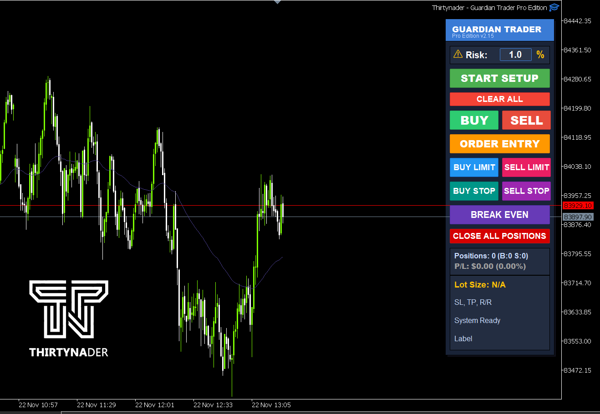
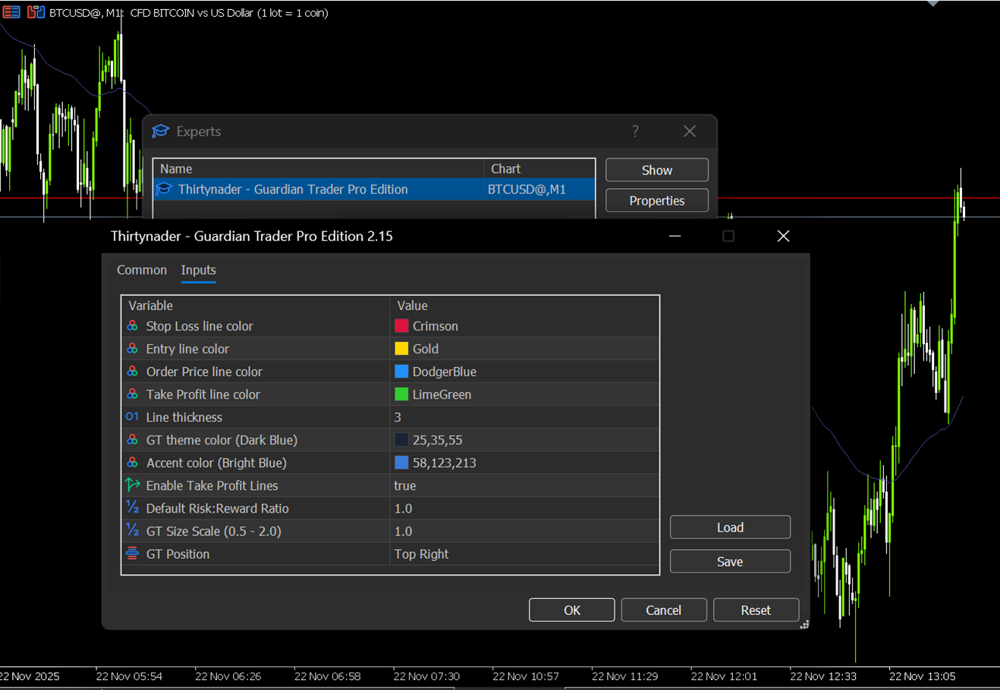

Guardian Trader Pro Edition
  
  

# Guardian Trader Pro - MetaTrader 5 Expert Advisor
## 📋 Overview

Guardian Trader Pro is a powerful trading assistant that helps you manage risk precisely by calculating optimal lot sizes based on your stop loss and risk percentage. With a modern, intuitive interface, it simplifies position sizing and trade execution.

---

## 📊 Version History

### **v2.15 (Latest) - Major Update**
**Release Date:** November 2024

#### 🆕 New Features Added:

1. **Buy Stop / Sell Stop Orders**
   - Full support for breakout trading strategies
   - Buy Stop button (Teal color) - Order above current price
   - Sell Stop button (Purple color) - Order below current price
   - Automatic price validation and freeze level checking

2. **Break Even Function**
   - One-click "Break Even" button
   - Automatically moves Stop Loss to entry price for all open positions
   - Only affects positions currently in profit
   - Individual position status reporting
   - Color: Purple

3. **Close All Positions**
   - Emergency close all button
   - Closes all open positions for current symbol with one click
   - Real-time position count feedback
   - Color: Red (for safety awareness)

4. **Live Statistics Display**
   - **Position Counter**: Shows total positions with Buy/Sell breakdown
     - Format: `Positions: 3 (B:2 S:1)`
   - **Profit/Loss Display**: Real-time P/L in both $ and %
     - Format: `P/L: $125.50 (2.51%)`
     - Dynamic color coding:
       - 🟢 Green for profit
       - 🔴 Red for loss
       - ⚪ Gray for break-even
   - Updates every second via timer

5. **Enhanced UI Layout**
   - Reorganized button placement for better workflow
   - Info section moved below order buttons for better visibility
   - Increased panel height (720px) to accommodate new features
   - Improved spacing between elements

6. **Text Wrapping System**
   - Long text automatically wraps to next line
   - Prevents text overflow from display boxes
   - Supports up to 4 lines of information
   - 26 characters per line limit with smart word breaking

---

### **v2.14 (Previous)**
**Base Features:**

1. **Core Money Management**
   - Dynamic lot size calculation based on risk percentage
   - Stop Loss and Entry price line management
   - Take Profit line with customizable Risk:Reward ratio
   - Real-time lot size updates when moving price lines

2. **Order Types**
   - Market Orders: Buy / Sell
   - Pending Orders: Buy Limit / Sell Limit
   - Order Entry mode for pending orders

3. **Visual Interface**
   - Modern dark theme UI
   - Draggable price lines on chart
   - Color-coded lines (SL: Red, Entry: Gold, TP: Green)
   - Scalable UI (0.5x to 2.0x)
   - 4 position presets (Top Left/Right, Bottom Left/Right)

4. **Risk Management**
   - Adjustable risk percentage (0.1% - 50%)
   - Account balance protection
   - Automatic volume normalization
   - Freeze level compliance

---

## 🔄 Key Improvements from v2.14 to v2.15

| Feature | v2.14 | v2.15 |
|---------|-------|-------|
| **Order Types** | Buy/Sell, Buy Limit/Sell Limit | ✅ + Buy Stop/Sell Stop |
| **Position Management** | Manual only | ✅ + Break Even Button |
| **Emergency Close** | Close individually | ✅ + Close All Positions |
| **Statistics** | None | ✅ Live Positions & P/L Display |
| **Text Display** | Fixed, could overflow | ✅ Smart word wrapping |
| **UI Height** | 540px | 720px (more space) |
| **Auto Updates** | None | ✅ Timer updates every second |
| **Status Feedback** | Basic | ✅ Enhanced with icons & colors |

---

## 📸 Screenshots

### New Features in v2.15:

```
┌─────────────────────────────┐
│   GUARDIAN TRADER PRO       │
│   v2.15                     │
├─────────────────────────────┤
│ Risk: [1.0] %               │
├─────────────────────────────┤
│     START SETUP             │
│     CLEAR ALL               │
├─────────────────────────────┤
│   [BUY]      [SELL]         │
├─────────────────────────────┤
│     ORDER ENTRY             │
│ [BUY LIMIT] [SELL LIMIT]    │
│ [BUY STOP]  [SELL STOP] ⭐  │
├─────────────────────────────┤
│   🆕 BREAK EVEN             │
│   🆕 CLOSE ALL POSITIONS    │
├─────────────────────────────┤
│ 📊 STATS (Updates Live):    │
│ Positions: 3 (B:2 S:1)      │
│ P/L: $125.50 (2.51%) 🟢     │
├─────────────────────────────┤
│ ℹ️ INFO:                    │
│ Lot Size: 0.15              │
│ SL: 50 pips | TP: 100       │
│ Ready to Execute ✅         │
└─────────────────────────────┘
```

---

## 🚀 Installation

1. Download `GuardianTraderPro_v2.15.mq5`
2. Place file in: `MetaTrader 5/MQL5/Experts/`
3. Restart MetaTrader 5
4. Drag EA onto any chart
5. Enable "AutoTrading" button

---

## 📖 User Guide

### Getting Started

#### 1. **Market Orders (Buy/Sell)**
   - Click `START SETUP`
   - Adjust Entry line (Gold) and Stop Loss line (Red)
   - Lot size auto-calculates based on your risk %
   - Click `BUY` or `SELL` to execute

#### 2. **Pending Orders - Limit**
   - Click `ORDER ENTRY`
   - Adjust Order Price line (Blue) and Stop Loss line (Red)
   - Lot size updates automatically
   - Click `BUY LIMIT` (price below market) or `SELL LIMIT` (price above market)

#### 3. **Pending Orders - Stop (NEW)**
   - Click `ORDER ENTRY`
   - Adjust Order Price line (Blue) and Stop Loss line (Red)
   - Lot size updates automatically
   - Click `BUY STOP` (price above market) or `SELL STOP` (price below market)
   - Perfect for breakout strategies

#### 4. **Break Even (NEW)**
   - Works on positions already in profit
   - Click `BREAK EVEN` button
   - Moves all Stop Loss to entry price (zero risk)
   - Protects profits automatically

#### 5. **Close All Positions (NEW)**
   - Emergency exit button
   - Click `CLOSE ALL POSITIONS`
   - Closes all open positions for current symbol
   - Use when market moves against you

---

## ⚙️ Settings

### Input Parameters:

| Parameter | Default | Description |
|-----------|---------|-------------|
| `StopLossColor` | Red | SL line color |
| `EntryLineColor` | Gold | Entry line color |
| `OrderPriceColor` | Blue | Order price line color |
| `TakeProfitColor` | Green | TP line color |
| `LineWidth` | 3 | Thickness of lines |
| `EnableTakeProfit` | true | Show TP line |
| `DefaultRiskReward` | 1.0 | Default R:R ratio |
| `UIScale` | 1.0 | UI size (0.5 - 2.0) |
| `UIPosition` | Top Right | Panel position |

---

## 🎨 Color Scheme

### Buttons:
- **Green**: START SETUP, BUY
- **Red**: CLEAR ALL, SELL, CLOSE ALL
- **Orange**: ORDER ENTRY
- **Blue**: BUY LIMIT
- **Pink**: SELL LIMIT
- **Teal**: BUY STOP (New)
- **Purple**: SELL STOP, BREAK EVEN (New)

### Status Colors:
- **Green** 🟢: Profit / Ready to execute
- **Red** 🔴: Loss / Error
- **Yellow** 🟡: Warning / Active setup
- **Gray** ⚪: Idle / Break-even

---

## 🛡️ Safety Features

1. **Freeze Level Check**: Prevents orders too close to market
2. **Volume Validation**: Auto-adjusts to broker min/max/step
3. **Price Normalization**: Rounds to valid tick size
4. **Balance Protection**: Risk % limits (0.1% - 50%)
5. **Position Filtering**: Only affects current symbol

---

## 💡 Pro Tips

1. **Use Break Even** when price moves 1:1 in your favor
2. **Buy/Sell Stop** is perfect for NFP, news breakouts
3. **Monitor P/L Display** for real-time performance
4. **Adjust Risk %** based on market volatility
5. **Use Close All** during high-impact news if worried

---

## 🔧 Technical Details

- **Platform**: MetaTrader 5
- **Language**: MQL5
- **UI Framework**: Custom graphical objects
- **Update Frequency**: 1 second (stats)
- **Magic Number**: 123456
- **Compatible**: All symbols (Forex, Metals, Indices, Crypto)

---

## 📜 Changelog

### v2.15 (Current)
- ✅ Added Buy Stop / Sell Stop orders
- ✅ Added Break Even button
- ✅ Added Close All Positions button
- ✅ Added live position counter
- ✅ Added real-time P/L display with % and color coding
- ✅ Improved text wrapping system
- ✅ Enhanced UI layout and spacing
- ✅ Increased panel height to 720px
- ✅ Added timer for auto-updates

### v2.14
- Info section moved below order buttons
- Text wrapping for long descriptions
- Improved font sizes and spacing
- Risk input field enhanced

### v2.13
- Initial public release
- Core money management features
- Visual price line system
- Buy/Sell and Limit orders

---

## ⚖️ License

Copyright 2025 Thirtynader. All rights reserved.

---

## ⭐ If you find this EA useful, please star the repository!

---

**Made with 💙 for the trading community**

## ✨ Key Features

 • Smart Lot Size Calculator - Automatically calculates position size based on your risk percentage and stop loss distance
 
 • Dual Trading Modes:
 
      • Market Execution - Instant Buy/Sell orders
      • Pending Orders - Buy/Sell Limit orders
      
 • Visual Setup - Drag-and-drop price lines for Entry, Stop Loss, and Take Profit
 
 • Risk/Reward Display - Real-time calculation of SL, TP distances and R:R ratio
 
 • Customizable UI - Scalable interface (0.5x - 2x) with adjustable positioning
 
 • Multi-Asset Support - Optimized for Forex, Gold, Silver, Oil, Indices (US30, NAS100, SPX)
 
 • Take Profit Management - Optional TP line with customizable risk/reward ratio
 
 • Real-time Updates - Lot size recalculates instantly when you move lines
 
 • Sound Alerts - Audio feedback for actions and confirmations
 
 
## 📥 Installation

 Step 1: Download the File
 
After purchase, you will receive the Guardian Trader Pro.ex5 file via email.

 Step 2: Install in MetaTrader 5
 
 
 • Option A: Automatic Installation
 
Double-click the Guardian Trader Pro.ex5 file

MetaTrader 5 will open automatically

Confirm the installation prompt


• Option B: Manual Installation

Open MetaTrader 5

Click File → Open Data Folder

Navigate to: MQL5 → Experts

Copy Guardian Trader Pro.ex5 into the Experts folder

Restart MetaTrader 5 or press F5 in Navigator


Step 3: Attach to Chart

Open Navigator panel (Ctrl+N)

Expand Expert Advisors section

Find Guardian Trader Pro

Drag and drop onto any chart


In the settings window:

    • Go to Common tab
    
    • Enable Allow Algo Trading
    
    • Click OK
    

Step 4: Verify Installation

The Guardian Trader panel appears on your chart

Check the Experts tab in Terminal for confirmation message

You should see: "Guardian Trader Pro - Modern Edition Ready!"


## 🎯 How to Use

Method 1: Market Orders (Instant Execution)

1- Start Setup

    • Click the START SETUP button
    
    • Three lines appear: Entry (Gold), Stop Loss (Red), Take Profit (Green)
    
2- Adjust Your Levels

    • Drag the Entry Line to your desired entry price
    
    • Drag the Stop Loss line to set your risk level
    
    • Drag the Take Profit line to set your target (optional)
    
3- Set Risk Percentage

    • Click on the risk input field (default 1%)
    
    • Enter your desired risk (0.1% to 50%)
    
    • Press Enter to confirm
    
4- Review Information

    • Check the calculated lot size
    
    • Review SL distance in pips
    
    • Verify Risk/Reward ratio
    
5- Execute Trade

    • Click BUY for long positions
    
    • Click SELL for short positions
    
    • Trade executes instantly at market price
    


Method 2: Pending Orders (Limit Orders)

1- Start Order Entry

    • Click the ORDER ENTRY button
    
    • Three lines appear: Order Price (Blue), Stop Loss (Red), Take Profit (Green)
    
3- Position Your Orders

    • Drag Order Price line to your desired entry level
    
    • Drag Stop Loss below Order Price for Buy Limit (above for Sell Limit)
    
    • Drag Take Profit to your target level
    
4- Set Risk & Review

    • Adjust risk percentage if needed
    
    • Check lot size calculation
    
    • Verify all price levels
    
3- Place Order

    • Click BUY LIMIT (order price must be below current price)
    
    • Click SELL LIMIT (order price must be above current price)
    
    • Order is placed and will execute when price reaches your level
    


## Additional Functions

  • CLEAR ALL - Removes all lines and resets the setup
  
  • Risk Input - Accepts decimal values (e.g., 0.5, 1.5, 2.0)
  
  • Line Dragging - Lot size updates automatically as you move lines
  
## ⚙️ Configuration

// Risk Management

input double DefaultRiskReward = 1.0;     // Default R:R ratio

input bool EnableTakeProfit = true;       // Show TP line


// Visual Settings

input double UIScale = 1.0;               // UI size (0.5 - 2.0)

input UI_POSITION UIPosition = UI_TOP_RIGHT;


// Line Colors & Style

input color StopLossColor = clrCrimson;

input color EntryLineColor = clrGold;

input color OrderPriceColor = clrDodgerBlue;

input color TakeProfitColor = clrLimeGreen;

input int LineWidth = 3;


// Theme

input color UIThemeColor = C'25,35,55';   // Dark Blue

input color UIAccentColor = C'58,123,213'; // Bright Blue


## 🎨 Interface Customization

UI Positions:

    • Top Left
    
    • Top Right (default)
    
    • Bottom Left
    
    • Bottom Right
    
    • Custom
    
Scaling: Adjust UIScale from 0.5 (compact) to 2.0 (large) for different screen sizes


## 💡 Tips


  • Optimal Distances: The EA automatically suggests optimal pip distances based on the asset type
  
  • Risk Management: Start with 1% risk and adjust based on your strategy
  
  • Multi-Timeframe: Works on all timeframes (M1 to MN)
  
  • Precision: Lot size follows broker's minimum/maximum lot and step size
  
  • One Chart: Only attach to one chart at a time for best performance
  

## ⚠️ Requirements


  • MetaTrader 5 platform (build 2000+)
  
  • Active trading account (demo or live)
  
  • Algo Trading must be enabled
  
  • Internet connection
  

## 💰 Purchase

  • Price: $50 USD
  
  • This is commercial software. To purchase:
  
📧 Email: Thirtynader@gmail.com

  • You will receive:
  
    1- Payment instructions
    
    2- Compiled EX5 file (ready to use)
    
    3- Installation guide
    
    4- Full support
    

## 🔒 Note

This repository contains only the source code for reference. The compiled EA (EX5 file) is required to run on MetaTrader 5 and must be purchased.


Developed by Thirtynader
