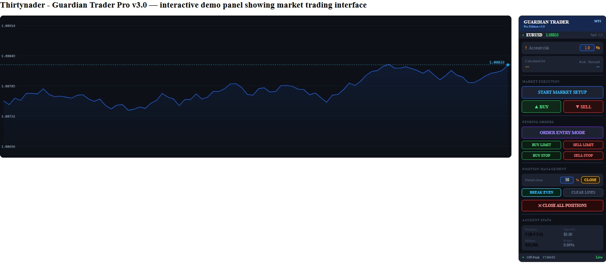

<div align="center">

# Guardian Trader Pro
### Professional Money Management & Trading Tool for MetaTrader 4 and 5!


<br/>

## 📢 Announcement

> 🎉 **This Expert Advisor is now available to everyone completely free!**
>
> We've decided to open this project up to the community at no cost. Download the latest version using the link below and start using it right away.

**[⬇️ Download the Latest Version](https://github.com/Thirtynader/Guardian-Trader-Pro/releases)**

---

## 📢 اطلاعیه

> 🎉 **این اکسپرت اکنون به‌صورت کاملاً رایگان در اختیار همه قرار دارد!**
>
> تصمیم گرفتیم این پروژه را به‌صورت رایگان در اختیار جامعه کاربران قرار دهیم. برای دریافت آخرین نسخه، از لینک زیر استفاده کنید.

**[⬇️ دانلود آخرین نسخه](https://github.com/Thirtynader/Guardian-Trader-Pro/releases)**

---

</div>

---

## 📦 Two Editions, One Tool

Guardian Trader Pro is now available in **two visual editions** — same powerful engine, different personality:

| Feature | 🌙 Modern Edition | 🖥️ Classic Edition |
|---|---|---|
| **Version** | v3.0 | v3.1 |
| **Theme** | Dark / Glassmorphism | Windows 2000 / ME |
| **Colors** | Navy, Gold, Electric Blue | Classic Gray `#D4D0C8` |
| **Font** | Arial Black | Tahoma / Courier New |
| **Borders** | Gradient, Glow effects | 3D Raised/Sunken (Win32 style) |
| **Scale buttons** | Floating `+` / `−` beside panel | Embedded in title bar |
| **Object prefix** | `GT_` | `GTC_` |
| **Magic number** | 300001 | 300002 |
| **Best for** | Modern monitors, dark UI lovers | Nostalgic traders, classic UI fans |

> Both editions share the **exact same trading logic** — lot calculation, SL/TP management, partial close, break-even, and all order types.

---

## ✨ Key Features

- 📊 **Automatic Lot Calculation** — based on account balance & risk %
- 🎯 **Market Order Execution** — Buy / Sell with one click
- 📝 **All Pending Order Types** — Buy/Sell Limit & Buy/Sell Stop
- 🔄 **Partial Position Close** — close any % of open positions
- ⚡ **One-Click Break Even** — moves SL to entry for all profitable positions
- 📈 **Live Account Stats** — balance, open P/L, return %
- 🌍 **Session Monitor** — Tokyo / London / London-NY / Sydney / Off-Peak
- 📡 **Spread Alert** — highlights abnormally high spread in red
- 🔊 **Sound Alerts** — optional audio feedback for every action
- 🎛️ **Scalable UI** — resize from 0.6× to 2.0× with `+` / `−` buttons

---

## 🖼️ Screenshots

<div align="center">

| Modern Edition | Classic Edition |
|:---:|:---:|
|  |  |
| *Dark glassmorphism theme* | *Windows 2000 / ME retro theme* |

</div>

---

## 🚀 Installation

1. Copy the `.ex5` file to:
   ```
   MetaTrader 5 / MQL5 / Experts /
   ```
2. Restart MetaTrader 5
3. Drag the Expert from the **Navigator** panel onto your chart
4. Configure settings in the dialog and click **OK**

> ⚠️ Make sure **AutoTrading** is enabled in MT5 before executing live orders.

---

## 📖 User Guide

### 1️⃣ Setting Your Risk

Enter your risk percentage in the **Risk %** field.  
The input color changes to indicate your risk level:

| Color | Risk Level |
|---|---|
| 🟢 Green | ≤ 1% |
| 🔵 Blue | 1–2% |
| 🟡 Yellow/Orange | 2–10% |
| 🔴 Red | > 10% |

---

### 2️⃣ Market Orders

```
Step 1 → Click  [ Start Market Setup ]
Step 2 → Three lines appear on the chart:
          🟡 Entry  — drag to your entry price
          🔴 SL     — drag to your stop loss level
          🟢 TP     — drag to your take profit (if enabled)
Step 3 → Lot size is calculated automatically
Step 4 → Click  [ ▲ Buy ]  or  [ ▼ Sell ]
```

---

### 3️⃣ Pending Orders

```
Step 1 → Click  [ Order Entry Mode ]
Step 2 → Three lines appear:
          🔵 Order Price — drag to desired pending price
          🔴 SL          — drag to stop loss
          🟢 TP          — drag to take profit (if enabled)
Step 3 → Select order type:
          [ Buy Limit ]   — buy below current price
          [ Sell Limit ]  — sell above current price
          [ Buy Stop ]    — buy above current price
          [ Sell Stop ]   — sell below current price
```

---

### 4️⃣ Position Management

#### Partial Close
1. Enter the percentage (e.g. `50`)
2. Click **[ Close ]**
3. That percentage of all open positions on the current symbol is closed

#### Break Even
- Click **[ Break Even ]**
- Stop Loss of all **profitable** positions is moved to their entry price

#### Close All
- Click **[ ✕ Close All Positions ]**
- All positions for the current symbol are closed immediately

#### Clear Lines
- Click **[ Clear Lines ]**
- All setup lines are removed from the chart and state is reset

---

## ⚙️ Settings Reference

### Line Colors
| Parameter | Default | Description |
|---|---|---|
| `InpColorSL` | Crimson | Stop Loss line color |
| `InpColorEntry` | Gold | Entry line color (market setup) |
| `InpColorOrder` | Blue | Order price line color (pending) |
| `InpColorTP` | Green | Take Profit line color |
| `InpLineWidth` | `2` | Thickness of all lines |

### Panel Layout
| Parameter | Default | Description |
|---|---|---|
| `InpUIScale` | `1.0` | UI scale factor (0.6 – 2.0) |
| `InpUICorner` | Top Right | Panel anchor position |

### Trading Settings
| Parameter | Default | Description |
|---|---|---|
| `InpDefaultRR` | `2.0` | Default Risk:Reward ratio for initial line placement |
| `InpEnableTP` | `true` | Show / hide Take Profit line |
| `InpSoundAlerts` | `true` | Enable / disable sound feedback |

---

## 🎛️ UI Scale

Both editions support live rescaling without restarting:

- **Modern Edition** — `+` / `−` buttons appear beside the panel (outside frame)
- **Classic Edition** — `+` / `−` buttons are embedded in the title bar (Win2K style)

Scale range: **0.6× → 2.0×** in steps of 0.1

---

## 💡 Tips

- ✅ Always test on a **demo account** first
- ✅ Start with a low risk percentage (1–2%)
- ✅ Verify the calculated lot size before executing
- ✅ High spread is highlighted in **red** — avoid trading during wide spreads
- ✅ Drag lines **after** clicking Setup/Order Entry — lot recalculates on every drag
- ✅ If `InpEnableTP = false`, Take Profit is set to `0` (broker default, no TP)

---

## 🔄 Version History

### Modern Edition
| Version | Changes |
|---|---|
| **v3.0** | Full UI rebuild — dark glassmorphism theme, floating scale buttons, grouped layout |
| **v2.18** | Improved lot size calculations, UI optimization |

### Classic Edition
| Version | Changes |
|---|---|
| **v3.1** | Windows 2000/ME theme, 3D raised/sunken borders, Tahoma font, title-bar scale buttons, compact layout |

---

📧 **Email:** Thirtynader@gmail.com

---

## ⚠️ Disclaimer

> Trading involves significant risk of loss. Guardian Trader Pro is a tool to assist your workflow — it does not guarantee profit. Always manage your risk responsibly and test thoroughly on a demo account before live trading.

---

<div align="center">

Made with ❤️ by **Thirtynader**

⭐ If you find Guardian Trader Pro useful, give the repo a star!

[](https://github.com/Thirtynader)
[](mailto:Thirtynader@gmail.com)

</div>

---

## ---------پارسی-----------

<div dir="rtl">

## 📋 معرفی

Guardian Trader Pro یک اکسپرت معاملاتی پیشرفته برای مدیریت حرفه‌ای سرمایه و اجرای معاملات در متاتریدر ۵ است. این ابزار حجم معاملات را بر اساس درصد ریسک شما به صورت خودکار محاسبه می‌کند.

حالا در **دو نسخه بصری** ارائه می‌شود:

| ویژگی | 🌙 نسخه مدرن | 🖥️ نسخه کلاسیک |
|---|---|---|
| **نسخه** | v3.0 | v3.1 |
| **تم** | تاریک / مدرن | ویندوز ۲۰۰۰ / ME |
| **فونت** | Arial Black | Tahoma / Courier New |
| **دکمه‌های اندازه** | کنار پنل (شناور) | داخل تایتل‌بار |

> هر دو نسخه از **موتور معاملاتی یکسان** استفاده می‌کنند.

---

## ✨ امکانات کلیدی

- 📊 **محاسبه خودکار لات** بر اساس موجودی و درصد ریسک
- 🎯 **اجرای سریع معاملات** — خرید/فروش با یک کلیک
- 📝 **انواع دستورات معلق** — Buy/Sell Limit & Stop
- 🔄 **بستن جزئی معاملات** — بستن هر درصدی از پوزیشن‌ها
- ⚡ **Break Even با یک کلیک** — انتقال SL به نقطه ورود
- 📈 **آمار زنده حساب** — موجودی، سود/زیان باز، بازده
- 🌍 **نمایش سشن معاملاتی** با هشدار اسپرد بالا
- 🔊 **هشدارهای صوتی** قابل تنظیم
- 🎛️ **مقیاس‌پذیری UI** از ۰.۶× تا ۲.۰× با دکمه‌های `+` / `−`

---

## 🚀 نصب و راه‌اندازی

۱. فایل `.ex5` را در پوشه زیر کپی کنید:
```
MetaTrader 5 / MQL5 / Experts /
```
۲. متاتریدر را ری‌استارت کنید  
۳. اکسپرت را از پنل Navigator روی چارت بکشید  
۴. تنظیمات دلخواه را اعمال و OK بزنید

---

## 📖 راهنمای استفاده

### ۱️⃣ تنظیم ریسک

درصد ریسک را در فیلد **Risk %** وارد کنید. رنگ متن بر اساس میزان ریسک تغییر می‌کند:

| رنگ | سطح ریسک |
|---|---|
| 🟢 سبز | ≤ ۱٪ |
| 🔵 آبی | ۱–۲٪ |
| 🟡 زرد/نارنجی | ۲–۱۰٪ |
| 🔴 قرمز | بیشتر از ۱۰٪ |

---

### ۲️⃣ معاملات بازاری

```
مرحله ۱ → کلیک روی  [ Start Market Setup ]
مرحله ۲ → سه خط روی چارت ظاهر می‌شود:
           🟡 Entry  — بکشید به قیمت ورود
           🔴 SL     — بکشید به حد ضرر
           🟢 TP     — بکشید به حد سود
مرحله ۳ → حجم معامله خودکار محاسبه می‌شود
مرحله ۴ → کلیک روی  [ ▲ Buy ]  یا  [ ▼ Sell ]
```

---

### ۳️⃣ دستورات معلق

```
مرحله ۱ → کلیک روی  [ Order Entry Mode ]
مرحله ۲ → سه خط ظاهر می‌شود:
           🔵 Order Price — قیمت دستور معلق
           🔴 SL          — حد ضرر
           🟢 TP          — حد سود
مرحله ۳ → نوع دستور را انتخاب کنید:
           [ Buy Limit ]   — خرید زیر قیمت فعلی
           [ Sell Limit ]  — فروش بالای قیمت فعلی
           [ Buy Stop ]    — خرید بالای قیمت فعلی
           [ Sell Stop ]   — فروش زیر قیمت فعلی
```

---

### ۴️⃣ مدیریت پوزیشن‌ها

**بستن جزئی:** درصد مورد نظر را وارد کنید → کلیک روی **Close**

**Break Even:** کلیک روی **Break Even** → SL همه معاملات سودده به نقطه ورود منتقل می‌شود

**بستن همه:** کلیک روی **✕ Close All Positions** → تمام پوزیشن‌های سیمبل فعلی بسته می‌شوند

**پاک کردن خطوط:** کلیک روی **Clear Lines** → همه خطوط حذف می‌شوند

---

## ⚙️ تنظیمات

| پارامتر | پیش‌فرض | توضیحات |
|---|---|---|
| `InpColorSL` | Crimson | رنگ خط حد ضرر |
| `InpColorEntry` | Gold | رنگ خط ورود |
| `InpColorOrder` | Blue | رنگ خط قیمت دستور |
| `InpColorTP` | Green | رنگ خط حد سود |
| `InpLineWidth` | `2` | ضخامت خطوط |
| `InpUIScale` | `1.0` | مقیاس UI (۰.۶ تا ۲.۰) |
| `InpUICorner` | Top Right | موقعیت پنل روی چارت |
| `InpDefaultRR` | `2.0` | نسبت ریسک به ریوارد پیش‌فرض |
| `InpEnableTP` | `true` | فعال/غیرفعال کردن خط حد سود |
| `InpSoundAlerts` | `true` | فعال/غیرفعال کردن صدا |

---

## 🔄 تاریخچه نسخه‌ها

### نسخه مدرن
| نسخه | تغییرات |
|---|---|
| **v3.0** | بازطراحی کامل UI — تم تاریک، دکمه‌های اندازه شناور |
| **v2.18** | بهبود محاسبات لات، بهینه‌سازی UI |

### نسخه کلاسیک
| نسخه | تغییرات |
|---|---|
| **v3.1** | تم ویندوز ۲۰۰۰/ME، بوردرهای ۳D، فونت Tahoma، دکمه‌های اندازه در تایتل‌بار |

---


📧 **ایمیل:** Thirtynader@gmail.com

---

## ⚠️ سلب مسئولیت

> معامله‌گری ریسک بالایی دارد. Guardian Trader Pro یک ابزار کمکی است و سود را تضمین نمی‌کند. همیشه ابتدا روی حساب دمو تست کنید.

---

<div align="center">

ساخته شده با ❤️ توسط **Thirtynader**

⭐ اگر Guardian Trader Pro را دوست دارید، یک ستاره به ما بدهید!

</div>

</div>
