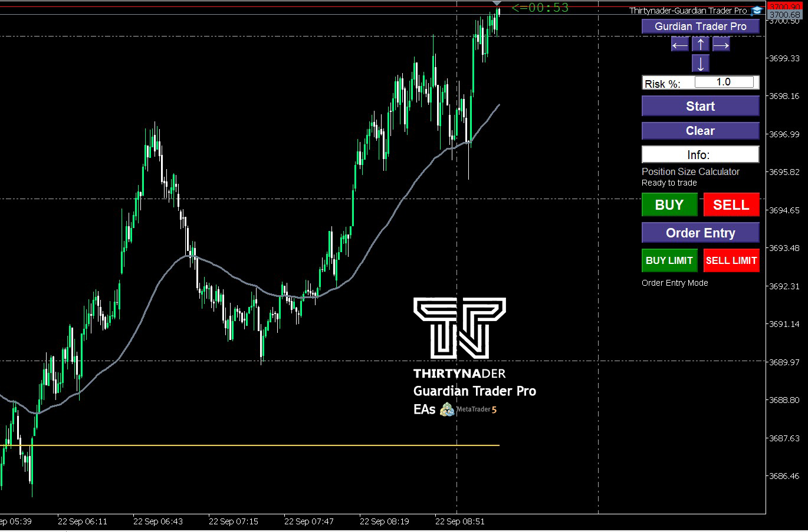

# Guardian Trader Pro – MT5 Expert Advisor

**Guardian Trader Pro** is the advanced version of the Guardian Trader Expert Advisor for MetaTrader 5.  
It extends the Lite version with full trade management features, interactive order entry, and drag & drop levels.

---

## Features

- Position Size Calculator - automatically calculates lot size based on selected risk %  
- Interactive Trading Panel - one-click BUY / SELL execution  
- Order Entry Mode - place pending orders (Buy Limit / Sell Limit) with built-in guidance  
- Drag & Drop Levels - adjust Stop Loss, Take Profit, and Entry Price directly on the chart  
- Fast Execution - simplified and quick trade operations  
- Risk Management - adjustable risk percentage for safe trading  

---

## Screenshots

  
  

---

## Versions

- [Guardian Trader Lite (Free)](https://github.com/Thirtynader/Guardian-Trade-Lite-MT5)  
- Guardian Trader Pro (this repository)  

---

## Installation & Usage

1. Download the **EX5 file** after purchase.  
2. Copy the file into:  
3. Restart MetaTrader 5.  
4. In MT5, open the **Navigator** panel (`Ctrl+N`).  
5. Find **Guardian Trader Pro** under *Expert Advisors*.  
6. Drag it onto the chart and allow algorithmic trading.  

---

## How to Get the Pro Version

To receive the **EX5 file** and support, please contact:  
**Thirtynader@gmail.com**

---

## Disclaimer

This Expert Advisor is a trading tool for risk and position management.  
Final trading decisions are the sole responsibility of the trader.
